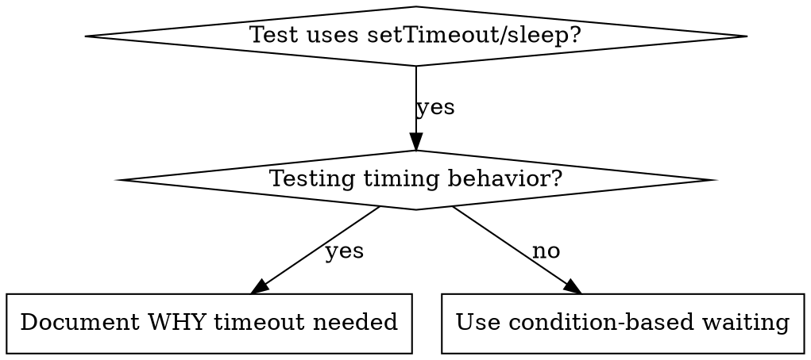

# Condition-Based Waiting

## Overview

Flaky tests often guess at timing with arbitrary delays. This creates race conditions where tests pass on fast machines but fail under load or in CI.

**Core principle:** Wait for the actual condition you care about, not a guess about how long it takes.

## When to Use



**Use when:**
- Tests have arbitrary delays (`setTimeout`, `sleep`, `time.sleep()`)
- Tests are flaky (pass sometimes, fail under load)
- Tests timeout when run in parallel
- Waiting for async operations to complete

**Don't use when:**
- Testing actual timing behavior (debounce, throttle intervals)
- Always document WHY if using arbitrary timeout

## Core Pattern

Reach for the polling primitive that already exists for your test runtime before writing your own.

**Vitest tests:** wrap the assertion in `vi.waitFor`. It retries the callback until it stops throwing or the timeout elapses, so any `expect` works as the condition.

```typescript
// BEFORE: Guessing at timing
await new Promise((r) => setTimeout(r, 50));
expect(send).toHaveBeenCalledTimes(1);

// AFTER: Retry the assertion until it holds
await vi.waitFor(() => expect(send).toHaveBeenCalledTimes(1));
```

**Effect tests:** poll an effect with `waitUntil` from `packages/comcom/agent-harness/test/_shared/Wait.ts`. It evaluates the effect until `predicate(value)` is true, then returns the value; it dies (raises a defect) on timeout, so callers never thread a typed timeout error.

```typescript
import { waitUntil } from '../_shared/Wait';

// Returns the matching value once the predicate holds
const entries = yield* waitUntil(
  handle.queue.list(),
  (queueEntries) => queueEntries.length >= 1,
  { timeout: Duration.seconds(5), interval: Duration.millis(10) }
);
```

`waitForCompletion` in the same file awaits a `send` result's completion `Deferred` with a timeout; prefer it over sleeping after sending a message.

## Quick Patterns

| Scenario | Vitest | Effect (`waitUntil`) |
|----------|--------|----------------------|
| Wait for call | `vi.waitFor(() => expect(send).toHaveBeenCalled())` | n/a |
| Wait for count | `vi.waitFor(() => expect(items).toHaveLength(5))` | `waitUntil(read, (items) => items.length >= 5)` |
| Wait for state | `vi.waitFor(() => expect(machine.state).toBe('ready'))` | `waitUntil(readState, (s) => s === 'ready')` |
| Wait for entry | `vi.waitFor(() => expect(events.find(e => e.type === 'DONE')).toBeDefined())` | `waitUntil(listEvents, (es) => es.some(e => e.type === 'DONE'))` |
| Complex condition | `vi.waitFor(() => { expect(obj.ready).toBe(true); expect(obj.value).toBeGreaterThan(10); })` | `waitUntil(read, (o) => o.ready && o.value > 10)` |

## Fallback Implementation

Only when neither `vi.waitFor` (no Vitest runtime) nor `waitUntil` (no Effect) is available, hand-roll a polling helper:

```typescript
async function waitFor<T>(
  condition: () => T | undefined | null | false,
  description: string,
  timeoutMs = 5000
): Promise<T> {
  const startTime = Date.now();

  while (true) {
    const result = condition();
    if (result) return result;

    if (Date.now() - startTime > timeoutMs) {
      throw new Error(`Timeout waiting for ${description} after ${timeoutMs}ms`);
    }

    await new Promise((r) => setTimeout(r, 10)); // Poll every 10ms
  }
}
```

See `condition-based-waiting-example.ts` in this directory for a standalone version with adaptable helpers (`waitForEvent`, `waitForEventCount`, `waitForEventMatch`).

## Common Mistakes

**Polling too fast:** `setTimeout(check, 1)` - wastes CPU
**Fix:** Poll every 10ms (the default for `waitUntil`)

**No timeout:** Loop forever if condition never met
**Fix:** Rely on the primitive's timeout; for hand-rolled loops, always include one with a clear error

**Stale data:** Cache state before loop
**Fix:** Re-read inside the condition (or pass a fresh-reading effect to `waitUntil`)

## When Arbitrary Timeout IS Correct

```typescript
// Tool ticks every 100ms - need 2 ticks to verify partial output
yield* waitUntil(listEvents, (es) => es.some(e => e.type === 'TOOL_STARTED')); // First: wait for condition
yield* Effect.sleep(Duration.millis(200)); // Then: wait for timed behavior
// 200ms = 2 ticks at 100ms intervals - documented and justified
```

**Requirements:**
1. First wait for triggering condition
2. Based on known timing (not guessing)
3. Comment explaining WHY

## Real-World Impact

Typical impact from replacing arbitrary sleeps in flaky async tests:
- Fixed 15 flaky tests across 3 files
- Pass rate: 60% -> 100%
- Execution time: 40% faster
- No more race conditions
