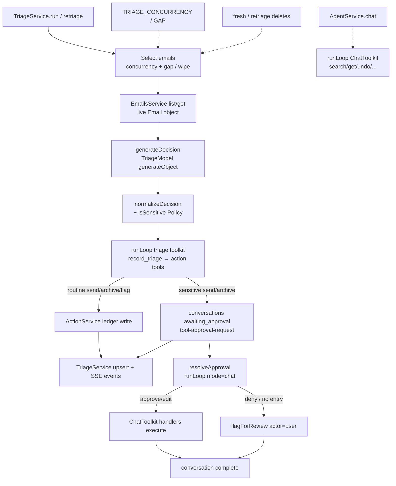
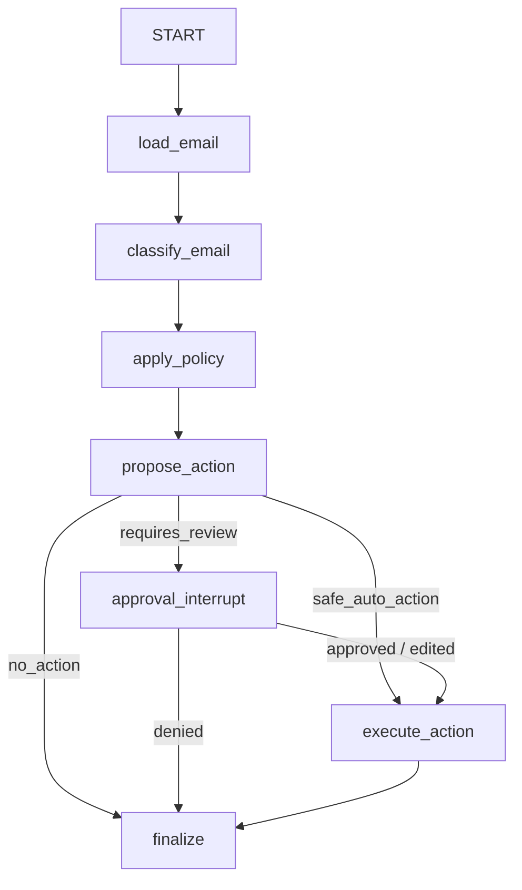

# Map current orchestration onto LangGraph nodes — research

## Summary

Today’s per-email path already matches Notion’s intended stages (`load → classify → policy → propose → approval/execute → finalize`), but those stages are **collapsed** into `AgentService.generateDecision` + a recursive Effect AI `runLoop`, not explicit nodes. Deterministic policy is a boolean fold inside `normalizeDecision`; propose and execute share one tool loop; approval is Effect’s `tool-approval-request` parked in `conversations`; finalize is scattered stream/DB writes with no run/trace summary. Batch fan-out, inbox chat, and destructive retriage/`fresh` wipe are real product behaviors that must stay **outside** the per-email LangGraph.

**Notion availability:** The source brief was fetched successfully from [Agentic Inbox v2 — LangGraph, Evals, Traces, Redis & Rivet](https://app.notion.com/p/39d3c065308b815fa0cfc3c38421396e). Local map notes in `.scratch/agentic-inbox-v2/map.md` refine charting preferences (LangGraph-only seam, no dual Legacy engine) but do not redefine the node sequence.

---

## Notion target graph

From the Notion brief (“Recommended LangGraph workflow”):

```
START
  ↓
load_email
  ↓
classify_email
  ↓
apply_policy
  ↓
propose_action
  ├── no_action ───────────────→ finalize
  ├── safe_auto_action ────────→ execute_action → finalize
  └── requires_review ─────────→ approval_interrupt
                                      ├── denied → finalize
                                      └── approved / edited
                                             ↓
                                       execute_action
                                             ↓
                                          finalize
```

**Branching semantics (Notion):**
- Model discretion lives inside specific nodes; the **application** owns workflow transitions and the autonomy boundary.
- `apply_policy` is deterministic code over raw email + model output; returns `requiresReview` + **reasons** + `policyVersion` (not only a boolean).
- `propose_action` may draft a reply but cannot bypass policy.
- `approval_interrupt` pauses indefinitely with a rich structured payload.
- `execute_action` is isolated from model work; idempotency key = `run_id + action_kind + action_revision`.
- `finalize` writes normalized run/trace summaries (latency, tokens, UI event).

**Local map override (charting, not Notion):** `.scratch/agentic-inbox-v2/map.md` settles on one `TriageEngine` seam with **LangGraph-only** implementation (no dual Legacy / shadow dual-run). That affects cutover strategy (tickets 02/09), not the node names above.

---

## Node-by-node mapping

### 1. `load_email`

| | |
|---|---|
| **Notion intent** | Load an **immutable snapshot** for the run; replay must use original input even if mailbox later changes. |
| **Current locations** | `TriageService.run` → `emails.list()` then passes live `Email` into `agent.triageEmail(email)` (`apps/api/src/Modules/Triage/Service.ts`); `TriageService.retriage` → `emails.get(emailId)`; dataset access in `EmailsService` / `EmailsServiceLive` (`apps/api/src/Modules/Emails/Service.ts`). Prompt materialization uses the in-memory object in `triageDecisionPrompt` / `triageActionPrompt` (`Prompts.ts`). |
| **What it does today** | Caller already holds a decoded `Email` when `AgentService.triageEmail` starts. There is **no** per-run snapshot table, `source` tag, or freeze of body/headers for replay. Static dataset is loaded once at layer construction. |
| **Gaps / mismatches** | No immutable run input; retriage/`fresh` mutate shared decision/ledger state rather than forking a snapshotted run. Notion `emailSnapshot.source` (`seed` \| `pasted` \| `synthetic` \| `api`) does not exist. |
| **Suggested LG responsibility** | Given `emailId` (or injected snapshot for evals), materialize `emailSnapshot` into graph state; never re-read mutable mailbox for replay of that `runId`. Call `EmailsService` (or ingest adapter) through a narrow Effect adapter — do not put DB clients in state. |

---

### 2. `classify_email`

| | |
|---|---|
| **Notion intent** | Strict structured output: category, severity, confidence, whyPreview, rationale, keyFacts. **Model must not own final safety.** |
| **Current locations** | `AgentService.generateDecision` (`Service.ts`); schema `DecisionFromModel`; prompt `triageDecisionPrompt` (`Prompts.ts`); model role `TriageModel` / `TriageModelLive` (`Model.ts` — `strictJsonSchema: true`, `response-healing`). |
| **What it does today (precise)** | One `LanguageModel.generateObject({ objectName: 'AgenticInboxDecision', schema: DecisionFromModel, ... })` with retry schedule (2s exponential × 2). Fields are optional at decode; `normalizeDecision` fills defaults (category `other`, severity `medium`, confidence clamp 0–1, whyPreview ≤65 chars, fallback rationale). Stamps `emailId` from caller. Model’s `isSensitive` field is **ignored** for the final Decision. |
| **Gaps / mismatches** | Classification and policy are fused in `normalizeDecision` (policy overwrites sensitivity). No separate graph state field for “raw model decision” vs “policy-adjusted decision”. No prompt/model version recorded on a run. |
| **Suggested LG responsibility** | Pure model node writing `decision` (without final `requiresReview`). Persist raw model output for traces/evals. Keep Effect schema decode / healing at the adapter boundary if desired. |

---

### 3. `apply_policy`

| | |
|---|---|
| **Notion intent** | Deterministic code on raw email + model output; return `requiresReview`, structured `reasons[]`, `policyVersion`. Raw body can overrule model. |
| **Current locations** | `isSensitive` in `apps/api/src/Modules/Actions/Policy.ts`; invoked only from `normalizeDecision` in `AgentService` (`Service.ts`). Gating consumption: `makeTriageToolkit(decision.isSensitive)` + `triageActionNeedsApproval` (`Toolkit.ts`). Tests: `Policy.test.ts`, `Toolkit.test.ts`. |
| **What it does today (precise)** | Returns a **boolean** true when: category ∈ `{financial,dispute,safety,escalation}` OR `confidence < 0.75` OR dollar regex OR legal/safety/escalation keyword lists match `${subject}\n${body}`. Result stored as `Decision.isSensitive`. That boolean drives whether send/archive tools pause (`needsApproval: () => sensitive`). `flag_for_review` never requires approval. |
| **Gaps / mismatches** | No `reasons` array, no `policyVersion`, no first-class policy object in state/UI. Sensitivity is collapsed into Decision rather than a separate policy artifact (Notion’s best showcase moment — model vs policy disagreement — cannot be rendered from current storage). Policy is applied **before** propose, but “requires review” only gates send/archive; the model may still choose `flag_for_review` or draft `send_reply` that pauses. |
| **Suggested LG responsibility** | Pure code node: input = snapshot + decision → `policy: { requiresReview, reasons, policyVersion }`. Branching after `propose_action` should consult this object, not recompute ad hoc. Keep implementation in Effect/`Policy.ts`; graph node is a thin call. |

---

### 4. `propose_action`

| | |
|---|---|
| **Notion intent** | Choose `send_reply` \| `archive` \| `flag_for_review` \| `no_action`; may draft body; cannot bypass policy. |
| **Current locations** | `AgentService.triageEmail` builds prompt via `TRIAGE_SYSTEM_PROMPT` + `triageActionPrompt(email, decision)` then `runLoop(prompt, 'triage', makeTriageToolkit(decision.isSensitive))` (`Service.ts`). Tools: `RecordTriage`, gated `SendReply`/`Archive`, `FlagForReview` (`Toolkit.ts`). Rules text in `Prompts.ts`. Multi-turn recursion: `MAX_AGENT_TURNS = 6`, `LanguageModel.generateText` with `concurrency: 4`. |
| **What it does today (precise)** | Prompt instructs: call `record_triage` first with the exact decision, then choose **one** next action. Model-driven tool selection (not a fixed enum node). `record_triage` handler → `ActionService.recordTriage` → `DecisionsRepo.upsert` (decision written mid-loop). If sensitive, send/archive emit `tool-approval-request` and loop stops. If not sensitive, handlers execute immediately (propose+execute fused). Routine path may complete in one generateText turn after tools run. |
| **Gaps / mismatches** | No `no_action` action kind (domain `ActionKind` is only send/archive/flag/undo). Propose is a **recursive agent loop**, not a single proposal node. `record_triage` mixes “persist classification” into propose. Decision is also upserted again by `TriageService.run` after return — dual write path. Proposal is not a first-class structured object separate from tool calls. |
| **Suggested LG responsibility** | Model (or constrained tool) node that writes `proposal: { action, body?, rationale }` only. Persist decision as a side effect of classify/finalize (or a dedicated write), not as a free-form tool the model can invent. Enforce policy: if `requiresReview` and action is send/archive → route to interrupt; if `flag_for_review`/`no_action` → skip interrupt per product rules. |

---

### 5. `approval_interrupt`

| | |
|---|---|
| **Notion intent** | Indefinite pause; payload includes email, proposed action, draft, rationale, **matched policy reasons**, confidence, run version metadata. Reviewer: approve / edit+approve / deny / request regeneration. |
| **Current locations** | Effect AI `needsApproval` on gated tools (`Toolkit.ts`); `findPendingApproval` / `approvalRequestFromPrompt` (`Service.ts`); persist via `conversations.save({ status: 'awaiting_approval', prompt, pending })` (`ConversationsRepo`); UI/stream via `TriageApprovalPending` in `TriageService.run`; resolve entrypoint `Actions/Http.ts` → `AgentService.resolveApproval`. Claim: `conversations.claimApproval`. Edit path: `withSendReplyBody`. |
| **What it does today (precise)** | Pause is **tool-metadata** + serialized Prompt JSON, not a graph interrupt. `ApprovalRequest` carries `id`, `emailId`, `action`, `summary`, `payload` (tool params), `createdAt` — **no** policy reasons, confidence, or versions. Verdicts: `approve` \| `deny` (+ optional `editedBody`). No “request regeneration” API. Resume: decode prompt → optional body rewrite → append `tool-approval-response` → `runLoop(resumed, 'chat', TriageToolkit)`. |
| **Gaps / mismatches** | Resume uses `mode: 'chat'`, so `runLoop` ignores the passed `TriageToolkit` and wires **`ChatToolkit` + `makeChatHandlers(..., 'chat_agent')`** — actor attribution becomes `chat_agent` after batch pause; toolkit always has static `needsApproval: true`. Regeneration unsupported. Approval state tied to conversation prompt blob (cutover risk for ticket 09). Double-resolve currently surfaces as `ApprovalNotFound` more often than `ApprovalAlreadyResolved` (test documents this). |
| **Suggested LG responsibility** | LangGraph interrupt/checkpoint with Notion-shaped payload; Effect HTTP maps approve/deny/edit into `TriageEngine.resume`. Do not encode workflow identity only as Effect Prompt JSON. |

---

### 6. `execute_action`

| | |
|---|---|
| **Notion intent** | Isolated from model work; DB idempotency `run_id + action_kind + action_revision`; never double-effect on resume/retry. |
| **Current locations** | `makeTriageHandlers` / `makeChatHandlers` → `ActionService.sendReply` / `archive` / `flagForReview` / `undoAction` (`Toolkit.ts`, `Actions/Service.ts`); ledger append in `ActionLedgerRepo`. Deny fallback in `resolveApproval`: if no new ledger entry, `actions.flagForReview({ actor: 'user', ... })`. |
| **What it does today (precise)** | Execution is **inside** the tool loop (or chat resume loop), not a dedicated post-model node. Routine send/archive execute when tools run; sensitive send/archive execute only after approval response. `flag_for_review` always executes immediately. Ledger is append-only with undo links, but **no** run-scoped idempotency key. Actor is `batch_agent` during triage handlers, `chat_agent` on chat/resume path, `user` for HTTP undo / deny fallback flag. |
| **Gaps / mismatches** | Not model-isolated. No idempotency constraint. Resume can re-enter a generative loop (`MAX_AGENT_TURNS`) rather than a single deterministic execute. Deny does not have a first-class “denied proposal” ledger kind — falls back to `flag_for_review`. |
| **Suggested LG responsibility** | Single code node after approval (or after safe_auto branch) calling `ActionService` with idempotent insert. No LLM. Simulation/replay must skip or dry-run this node (Notion Phase 8 / out of scope for must-have map, but shapes the node contract). |

---

### 7. `finalize`

| | |
|---|---|
| **Notion intent** | Normalized run + trace summaries; latency/token totals; publish final UI event. |
| **Current locations** | After `triageEmail`: conversation `complete` or `awaiting_approval`; diff ledger for `TriageActed` events; `TriageService.run` upserts decision and emits `TriageStarted` / `TriageDecided` / actions / `TriageApprovalPending` / per-email `TriageFailed`; batch ends with `TriageRunDone({ processed })`. Inbox status derived later in `statusForItem`. |
| **What it does today (precise)** | Stream events are the “finalize” surface. No `triage_runs` / `trace_events` tables, no token/cost/latency aggregation, no graph/prompt/policy version stamps. Failures are isolated per email via `Effect.catch` → `TriageFailed`. |
| **Gaps / mismatches** | Finalize is not a node; metrics and immutable run history are missing (called out in Notion Phase 1 and local ticket 03). Batch `TriageRunDone` is a **batch** event, not per-email finalize. |
| **Suggested LG responsibility** | Per-email terminal node: write product run row + trace rollup; emit SSE-friendly summary through Effect without leaking LangGraph types (seam ticket 02). |

---

### Cross-cutting: how one email is triaged end-to-end today

1. **HTTP** `triage.run` / `retriage` → `TriageService` (`Http.ts`).
2. **Select emails** — batch: all without existing decisions (+ optional destructive wipe if `fresh`); retriage: wipe one email then process.
3. **Pass `Email`** into `AgentService.triageEmail`.
4. **Classify** — `generateDecision` (TriageModel).
5. **Policy fold** — `normalizeDecision` → `isSensitive`.
6. **Propose(+maybe execute)** — tool loop with sensitivity-gated toolkit.
7. **If pending approval** — save conversation; return `ApprovalRequest`; stream `approval_pending`.
8. **Else** — save complete conversation; return new ledger actions.
9. **TriageService** upserts decision again; emits stream events.
10. **Later resume** — `actions.resolveApproval` → `AgentService.resolveApproval` → chat-mode tool loop → ledger entry (or flag on deny).

---

## Control-flow diagram

### Today (collapsed Effect loop)



### Target (Notion LangGraph)



### ASCII (today vs target alignment)

```
Notion node          Today (approximate home)
─────────────        ────────────────────────
load_email           TriageService + EmailsService (no snapshot)
classify_email       AgentService.generateDecision
apply_policy         normalizeDecision → Policy.isSensitive (bool only)
propose_action       runLoop + triageActionPrompt + tools (incl. record_triage)
approval_interrupt   needsApproval + ConversationsRepo prompt blob
execute_action       Toolkit handlers / ActionService (fused with loop)
finalize             Triage stream events + conversation save (no run row)
```

---

## Outside LangGraph (deliberately)

| Behavior | Where it lives today | Why it must stay outside the per-email graph |
|---|---|---|
| **Batch triage concurrency & pacing** | `TriageService.run`: `TRIAGE_CONCURRENCY`, `TRIAGE_GAP_MS`, `Stream.mapEffect` | Fan-out / rate limiting across many emails is orchestration of **many** graph runs, not a node inside one. Notion assigns cross-process limits to Redis later; process-local knobs stay in Effect/`TriageService` (or a worker). |
| **Batch run selection & SSE aggregation** | `TriageService.run` filters undecided emails; emits `TriageRunDone`; per-email catch → `TriageFailed` | Graph = one email. Batch “which emails / stream wrapper / processed count” is Effect HTTP concern. |
| **Inbox chat assistant** | `AgentService.chat`, `CHAT_SYSTEM_PROMPT`, `ChatToolkit` (search/get_thread/list_ledger/undo + mutating tools), `HttpChatLive` | Interactive multi-email Q&A loop; Notion and `map.md` treat chat as separate / undecided alignment. Ticket 09 explicitly asks what Effect AI remains for chat only. |
| **Destructive retriage** | `TriageService.retriage`: `decisions.deleteByEmail`, `clearLedgerForEmail`, `conversations.deleteByEmail`, then triage | Notion: stop deleting history; retriage = **new linked run**. Wipe logic must not be a LangGraph node; replace with Effect “start new run” + link parent (ticket 03). |
| **Destructive fresh batch wipe** | `TriageService.run(fresh=true)`: `deleteAll` decisions, `clearLedger`, `deleteTriage` conversations | Same rationale — demo reset is an Effect/admin operation, not graph state transition. |
| **Inbox join / status derivation** | `TriageService.inbox`, `statusForItem`, `summaryForItems` | Read model over decisions + ledger + awaiting conversations; not workflow. |
| **User undo via HTTP** | `Actions/Http.ts` → `ActionService.undoAction` | Human audit operation on ledger; not part of triage graph (chat undo tool also outside). |
| **Approval HTTP mapping** | `Actions/Http.ts` `resolveApproval` | Stays Effect; should call `TriageEngine.resume`, not embed LangGraph types. |
| **Deterministic policy implementation** | `Actions/Policy.ts` | Remains Effect domain code; graph **calls** it from `apply_policy` node. |
| **Ledger / repos / schemas** | `ActionService`, repos, `api-core` | PostgreSQL business truth; Notion: do not rewrite into LangChain. |
| **Provider model config** | `Model.ts` OpenRouter layers | May move behind LangChain integrations for graph nodes, but config/DI spine can stay Effect-injected into the engine adapter. |
| **Redis coordination (future)** | Not implemented; Notion + ticket 07 | Rate limits / permits / ingest dedup around the engine — outside graph nodes. |
| **Synthetic mailbox / Rivet (optional)** | Out of scope per `map.md` | Owns mailbox session lifecycle, not per-email decision graph. |

---

## Open ambiguities for later tickets

Facts that block a clean mapping (not style preferences):

1. **`no_action` vs `flag_for_review`:** Notion proposes an explicit `no_action` branch to finalize; today’s domain and toolkit have no `no_action`. Is “leave alone” represented as flag, as skip, or a new kind? Blocks propose/finalize edge labels.

2. **Where decision persistence lives:** Today `record_triage` tool mid-loop **and** `TriageService` upsert after return. Graph needs one authoritative write point relative to classify vs finalize (affects traces and evals).

3. **Policy object vs `Decision.isSensitive`:** Notion requires structured reasons + version; current API/Decision schema only expose boolean. Mapping is clear directionally, but product schema change is required before traces can show “model vs policy” (blocks ticket 04 alignment).

4. **Resume actor & toolkit identity:** `resolveApproval` intentionally or accidentally runs `mode: 'chat'` → `chat_agent` handlers / ChatToolkit. Exact resume semantics for LangGraph (actor attribution, single execute vs re-enter model) must be specified before seam freeze (ticket 02).

5. **Approval verdict surface:** Notion lists “request regeneration”; current `ApprovalDecisionRequest` only approve/deny(+edit). Is regeneration in-graph (loop back to `propose_action`) or out of must-have?

6. **Chat vs triage shared `AgentService`:** Same `runLoop` / conversations table. How much of chat stays Effect AI after cutover is open in `map.md` “Not yet specified” and ticket 09 — affects whether approval storage can be triage-run-only.

7. **Idempotent execute key fields:** Notion specifies `run_id + action_kind + action_revision`, but there is no `run_id` or action revision today — depends on immutable runs (ticket 03) before execute_action can be specified fully.

8. **Charting vs Notion Phase 0 dual engines:** Notion recommends Legacy + LangGraph shadow; `map.md` already settled LangGraph-only / no shadow. Mapping research does not need dual engines, but cutover of in-flight conversation-tied approvals remains an ambiguity for ticket 09.

---

## Sources

- `https://app.notion.com/p/39d3c065308b815fa0cfc3c38421396e` — canonical target graph, node responsibilities, graph state shape, persistence split, what’s outside LangGraph.
- `/mnt/work/code/personal/agentic-inbox/.scratch/agentic-inbox-v2/map.md` — local charting decisions (LangGraph-only seam, Effect spine, out of scope).
- `/mnt/work/code/personal/agentic-inbox/.scratch/agentic-inbox-v2/issues/01-map-orchestration-to-langgraph-nodes.md` — ticket question framing.
- `/mnt/work/code/personal/agentic-inbox/.scratch/agentic-inbox-v2/issues/02-freeze-triage-engine-seam.md` — seam/resume/stream follow-on.
- `/mnt/work/code/personal/agentic-inbox/.scratch/agentic-inbox-v2/issues/03-immutable-runs-vs-checkpoints.md` — retriage-as-new-run / execute idempotency follow-on.
- `/mnt/work/code/personal/agentic-inbox/.scratch/agentic-inbox-v2/issues/09-cutover-delete-old-loop.md` — chat vs triage cutover follow-on.
- `/mnt/work/code/personal/agentic-inbox/apps/api/src/Modules/Agent/Service.ts` — `generateDecision`, `runLoop`, `triageEmail`, `resolveApproval`, `chat`, `normalizeDecision`, approval helpers.
- `/mnt/work/code/personal/agentic-inbox/apps/api/src/Modules/Agent/Toolkit.ts` — tools, `makeTriageToolkit` gating, handlers.
- `/mnt/work/code/personal/agentic-inbox/apps/api/src/Modules/Agent/Prompts.ts` — classify vs action prompts and system prompts.
- `/mnt/work/code/personal/agentic-inbox/apps/api/src/Modules/Agent/Model.ts` — TriageModel vs ToolModel roles.
- `/mnt/work/code/personal/agentic-inbox/apps/api/src/Modules/Triage/Service.ts` — batch concurrency, fresh wipe, retriage, stream finalize, inbox.
- `/mnt/work/code/personal/agentic-inbox/apps/api/src/Modules/Triage/Http.ts` — HTTP entrypoints.
- `/mnt/work/code/personal/agentic-inbox/apps/api/src/Modules/Actions/Policy.ts` — `isSensitive` deterministic gate.
- `/mnt/work/code/personal/agentic-inbox/apps/api/src/Modules/Actions/Service.ts` — ledger mutations / `recordTriage`.
- `/mnt/work/code/personal/agentic-inbox/apps/api/src/Modules/Actions/Http.ts` — resolveApproval + undo HTTP.
- `/mnt/work/code/personal/agentic-inbox/apps/api/src/Modules/Emails/Service.ts` — email load surface.
- `/mnt/work/code/personal/agentic-inbox/apps/api/src/Modules/Chat/Repo.ts` — conversation/approval persistence.
- `/mnt/work/code/personal/agentic-inbox/apps/api/src/Modules/Chat/Http.ts` — chat HTTP.
- `/mnt/work/code/personal/agentic-inbox/packages/api-core/src/Modules/Triage/Domain.ts` — Decision / TriageRunRequest(`fresh`).
- `/mnt/work/code/personal/agentic-inbox/packages/api-core/src/Modules/Triage/Events.ts` — SSE event shapes.
- `/mnt/work/code/personal/agentic-inbox/packages/api-core/src/Modules/Actions/Domain.ts` — ActionKind, ApprovalRequest, ApprovalDecisionRequest.
- `/mnt/work/code/personal/agentic-inbox/apps/api/test/Modules/Agent/AgentLoop.test.ts` — routine auto-exec vs sensitive pause vs edited resume.
- `/mnt/work/code/personal/agentic-inbox/apps/api/test/Modules/Agent/ResolveApproval.test.ts` — approve/edit/deny/idempotent claim behavior.
- `/mnt/work/code/personal/agentic-inbox/apps/api/test/Modules/Agent/Toolkit.test.ts` — sensitivity gate on send/archive.
- `/mnt/work/code/personal/agentic-inbox/apps/api/test/Modules/Actions/Policy.test.ts` — policy invariants.
- `/mnt/work/code/personal/agentic-inbox/apps/api/test/Modules/Triage/Service.test.ts` — fresh wipe + per-email destructive retriage.
